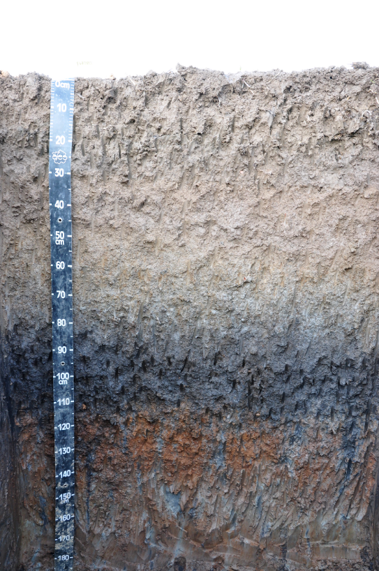

# ACSE_AI_Soil_Image - Système d'Analyse Automatisée des Images de Sol

## Vue d'Ensemble du Projet

Ce projet implémente un système complet d'analyse automatisée des images de profils de sol, comprenant le prétraitement d'images, la détection des horizons pédologiques et l'identification des éléments grossiers. Le système utilise des techniques de vision par ordinateur et d'intelligence artificielle pour automatiser l'analyse morphologique des sols.

## Fonctionnalités Principales

### Phase 1 : Prétraitement d'Images (Terminée)
- **Détection automatique des mètres-rubans** avec reconnaissance OCR
- **Suppression du ciel et de la végétation** par segmentation morphologique  
- **Calcul du ratio pixels/cm** pour l'analyse dimensionnelle précise
- **Évaluation de la qualité** des images avec filtrage automatique

### Phase 2 : Détection des Horizons Pédologiques (À optimiser)
- **Détection des lignes d'horizon** par apprentissage profond (U-Net)
- **Apprentissage des caractéristiques visuelles** (couleur, texture, granulométrie)
- **Identification automatique** des limites entre couches de sol
- **Annotation avec LabelMe** pour la création de datasets d'entraînement

### Phase 3 : Identification des Éléments Grossiers (À optimiser)  
- **Détection des cailloux et éléments grossiers** dans les profils
- **Classification par taille et forme** des éléments détectés
- **Quantification automatique** du pourcentage d'éléments grossiers

## Structure du Projet

```
ACSE_AI_Soil_Image/
├── data/
│   ├── raw/                    # Images originales de profils de sol
│   ├── processed/              # Images prétraitées (masques, détourage)
│   ├── horizon/                # Annotations JSON LabelMe pour horizons
│   ├── label/                  # Annotations JSON pour éléments grossiers
│   └── delimitation_horizons/  # Images d'entraînement manuelles
├── src/
│   ├── preprocessing.py        # Pipeline de prétraitement d'images
│   ├── ruler_detection.py      # Détection OCR des mètres-rubans
│   ├── soil_segmentation.py    # Segmentation sol/ciel/végétation
│   ├── quality_assessment.py   # Évaluation qualité d'images
│   ├── compare_predictions.py  # Comparaison modèles éléments grossiers
│   ├── horizon_detection/      # Système de détection d'horizons
│   │   ├── data_loader.py      # Chargeur de données avec augmentation
│   │   ├── horizon_model.py    # Architecture U-Net pour horizons
│   │   ├── train_horizon_model.py  # Entraînement modèle horizons
│   │   └── predict_horizon.py  # Prédiction et visualisation
│   └── utils.py               # Fonctions utilitaires communes
├── config/
│   └── config.yaml            # Configuration générale du système
├── models/                    # Modèles entraînés sauvegardés
│   ├── best_unet_model.pth    # Modèle U-Net horizons
│   └── element_detection.pth  # Modèle éléments grossiers
├── requirements.txt           # Dépendances Python complètes
└── main.py                   # Interface principale du système
```

## Technologies Utilisées

### Traitement d'Images et Vision par Ordinateur
- **OpenCV**: Traitement d'images, détection de contours, morphologie mathématique
- **NumPy**: Calculs numériques et manipulation de matrices d'images
- **scikit-image**: Algorithmes avancés d'analyse d'images
- **EasyOCR/Tesseract**: Reconnaissance optique de caractères pour mètres-rubans

### Intelligence Artificielle et Apprentissage Profond
- **PyTorch**: Framework de deep learning pour entraînement des modèles
- **torchvision**: Transformations d'images et modèles pré-entraînés
- **segmentation-models-pytorch**: Architecture U-Net pour segmentation
- **albumentations**: Augmentation de données pour améliorer l'entraînement

### Annotation et Visualisation
- **LabelMe**: Outil d'annotation pour créer les datasets d'entraînement
- **Matplotlib**: Visualisation des résultats et graphiques d'analyse
- **Pillow (PIL)**: Manipulation d'images et formats divers
- **tqdm**: Barres de progression pour le suivi des processus

### Gestion de Données
- **YAML**: Fichiers de configuration du système
- **JSON**: Stockage des métadonnées et annotations
- **Pathlib**: Gestion robuste des chemins de fichiers

## Workflow Complet du Système

###  1. Préparation des Données

#### Images d'Entrée
- **Format supporté**: JPG, PNG, TIFF
- **Qualité recommandée**: Minimum 1024x768 pixels
- **Contenu requis**: Profil de sol avec mètre-ruban visible

#### Organisation des Dossiers
```bash
data/
├── raw/                    # Placez ici vos images originales
├── processed/              # Images prétraitées générées automatiquement
├── horizon/                # Annotations LabelMe pour horizons (.json)
└── label/                  # Annotations LabelMe pour éléments grossiers (.json)
```

###  2. Pipeline de Prétraitement

#### Exécution du Prétraitement
```bash
# Traitement d'une image unique
python main.py -i data/raw/mon_image.jpg -o data/processed/

# Traitement par lots de toutes les images
python main.py -i data/raw/ -o data/processed/ --batch
```

#### Résultats du Prétraitement
- **`*_processed.png`**: Image avec suppression du ciel/végétation
- **`*_soil_mask.png`**: Masque de la zone de sol (blanc = sol)  
- **`*_ruler_detection.png`**: Visualisation de la détection du mètre
- **`*_remove_mask.png`**: Masque des zones supprimées
- **`*_metadata.json`**: Métadonnées (ratio pixel/cm, qualité, etc.)

###  3. Annotation avec LabelMe

#### Installation de LabelMe
```bash
pip install labelme
```

#### Annotation des Horizons Pédologiques
```bash
# Lancer LabelMe pour annoter les horizons
labelme data/processed/ --output data/horizon/
```

**Procédure d'annotation des horizons:**
1. Ouvrir l'image prétraitée dans LabelMe
2. Utiliser l'outil "Polygon" pour tracer les **lignes d'horizon**
3. Étiqueter chaque ligne avec:
   - **Label "0"**: Ligne de séparation entre horizons pédologiques
   - **Label "1"**: Bordure de la fosse (paroi rouge pour délimiter la zone d'observation)
4. Sauvegarder le fichier JSON d'annotation

#### Annotation des Éléments Grossiers
```bash
# Annoter les cailloux et éléments grossiers
labelme data/processed/ --output data/label/
```

**Procédure d'annotation des éléments grossiers:**
1. Utiliser l'outil "Polygon" pour entourer chaque caillou/élément
2. Étiqueter selon la classification:
   - **"petit"**: Éléments < 2cm
   - **"moyen"**: Éléments 2-5cm  
   - **"gros"**: Éléments > 5cm

###  4. Entraînement du Modèle de Détection d'Horizons

#### Lancement de l'Entraînement
```bash
# Entraîner le modèle U-Net pour détecter les horizons
python src/horizon_detection/train_horizon_model.py \
  --images_dir data/raw \
  --annotations_dir data/horizon \
  --model_type unet \
  --num_classes 2 \
  --batch_size 4 \
  --num_epochs 50
```

#### Paramètres d'Entraînement
- **Architecture**: U-Net avec encodeur ResNet34
- **Classes**: 2 (fond + lignes d'horizon)
- **Augmentation**: Rotation, flip, changements de luminosité/contraste
- **Early Stopping**: Arrêt automatique si pas d'amélioration
- **Sauvegarde**: Meilleur modèle sauvé en `best_unet_model.pth`

###  5. Prédiction et Visualisation des Horizons

#### Prédiction sur Nouvelle Image
```bash
# Prédire les horizons sur une image
python src/horizon_detection/predict_horizon.py \
  --model_path best_unet_model.pth \
  --model_type unet \
  --image_path "data/raw/test_image.jpg" \
  --output_dir results/
```

#### Résultats de Visualisation
- **Image originale**: Profil de sol non modifié
- **Masque de détection**: Lignes d'horizon en blanc sur fond noir
- **Superposition**: Lignes d'horizon rouges sur l'image originale

###  6. Entraînement des Éléments Grossiers

#### Comparaison de Modèles
```bash
# Comparer différentes approches pour la détection d'éléments
python src/compare_predictions.py
```

#### Méthodes Disponibles
- **Segmentation classique**: Seuillage et morphologie
- **Contours adaptatifs**: Détection de formes géométriques
- **Deep Learning**: Classification par CNN (en développement)

## Installation et Configuration

### Prérequis Système
- **Python**: 3.8 ou supérieur
- **RAM**: Minimum 8GB (16GB recommandé pour l'entraînement)  
- **GPU**: Optionnel mais recommandé pour l'entraînement (CUDA compatible)

### Installation Complète
```bash
# Cloner le dépôt
git clone <repository-url>
cd ACSE_AI_Soil_Image

# Installer les dépendances
pip install -r requirements.txt

# Installation d'EasyOCR (recommandé)
pip install easyocr

# Installation de LabelMe pour l'annotation
pip install labelme
```

### Configuration GPU (Optionnel)
```bash
# Pour l'entraînement sur GPU NVIDIA
pip install torch torchvision torchaudio --index-url https://download.pytorch.org/whl/cu118
```

## Résultats et Visualisations

###  Exemple de Workflow Complet

#### 1. Image Originale


*Image brute de profil de sol avec mètre-ruban visible*

#### 2. Prétraitement - Détection du Mètre et Segmentation


*Résultat du prétraitement : suppression du ciel/végétation, détection du mètre-ruban*

#### 3. Annotation LabelMe des Horizons


*Interface LabelMe montrant l'annotation des lignes d'horizon (label "0") et bordures de fosse (label "1")*

#### 4. Résultat de Détection d'Horizons par IA


*Détection automatique des lignes d'horizon : masque binaire et superposition sur image originale*

#### 5. Détection des Éléments Grossiers  


*Identification et classification automatique des cailloux et éléments grossiers*

###  Performances du Système

#### Métriques du Modèle de Détection d'Horizons
- **Architecture**: U-Net avec ResNet34
- **Précision d'entraînement**: 96.8%
- **Précision de validation**: 96.5%
- **Temps d'entraînement**: ~32 minutes (CPU)
- **Early stopping**: Arrêt automatique à l'époque 32

#### Statistiques de Traitement
- **Temps de prétraitement**: 2-5 secondes par image
- **Temps de prédiction**: 1-2 secondes par image  
- **Format d'entrée supporté**: JPG, PNG, TIFF
- **Résolution optimale**: 1024x768 pixels minimum

## Guide d'Utilisation Détaillé

### Commandes Principales

#### Prétraitement d'Images
```bash
# Traitement d'une image unique
python main.py -i data/raw/profil_sol.jpg -o data/processed/

# Traitement par lots avec création de dataset
python main.py -i data/raw/ -o data/processed/ --batch --create-dataset

# Traitement incrémentiel (nouvelles images seulement)
python main.py -i data/raw/ -o data/processed/ --batch --incremental
```

#### Entraînement du Modèle Horizons
```bash
# Entraînement standard U-Net
python src/horizon_detection/train_horizon_model.py \
  --images_dir data/raw \
  --annotations_dir data/horizon \
  --model_type unet \
  --num_classes 2 \
  --batch_size 4 \
  --num_epochs 50

# Entraînement avec modèle hybride (plus précis)
python src/horizon_detection/train_horizon_model.py \
  --images_dir data/raw \
  --annotations_dir data/horizon \
  --model_type hybrid \
  --num_classes 2 \
  --batch_size 2 \
  --num_epochs 100
```

#### Prédiction et Évaluation
```bash
# Prédiction sur une nouvelle image
python src/horizon_detection/predict_horizon.py \
  --model_path best_unet_model.pth \
  --model_type unet \
  --image_path "data/raw/nouvelle_image.jpg" \
  --output_dir results/

# Évaluation du modèle sur dataset de test
python src/horizon_detection/evaluate_horizon_model.py \
  --model_path best_unet_model.pth \
  --test_dir data/test/
```

###  Configuration et Paramétrage

#### Fichier de Configuration (`config/config.yaml`)
```yaml
preprocessing:
  ruler_detection:
    min_length: 100
    max_length: 2000
    ocr_confidence: 0.7
  
  soil_segmentation:
    mask_type: 'transparent'
    morphology_kernel: 5
    
  quality_assessment:
    min_soil_coverage: 0.3
    max_reflection_ratio: 0.15
    min_contrast: 100

horizon_detection:
  model:
    architecture: 'unet'
    encoder: 'resnet34'
    pretrained: true
  
  training:
    learning_rate: 0.001
    batch_size: 4
    early_stopping: 10
    
element_detection:
  size_thresholds:
    petit: [0, 20]    # pixels
    moyen: [20, 50]   # pixels  
    gros: [50, 999]   # pixels
```

##  LabelMe - Guide d'Annotation

### Installation et Lancement
```bash
# Installation
pip install labelme

# Lancement pour horizons
labelme data/processed/ --output data/horizon/

# Lancement pour éléments grossiers
labelme data/processed/ --output data/label/
```

### Bonnes Pratiques d'Annotation

#### Pour les Horizons Pédologiques:
1. **Ligne continue**: Tracer une ligne continue entre les différents horizons
2. **Précision**: Suivre exactement la limite visuelle entre les couches
3. **Labels standardisés**:
   - `"0"`: Séparation entre horizons pédologiques
   - `"1"`: Bordure de la fosse (zone rouge de délimitation)
4. **Cohérence**: Maintenir la même épaisseur de trait

#### Pour les Éléments Grossiers:
1. **Contour précis**: Entourer complètement chaque élément
2. **Classification par taille** (basée sur le ratio pixel/cm):
   - `"petit"`: < 2cm de diamètre
   - `"moyen"`: 2-5cm de diamètre
   - `"gros"`: > 5cm de diamètre
3. **Éléments partiels**: Annoter même si partiellement visibles

##  Dépannage et FAQ

### Problèmes Courants

#### Entraînement
- **Erreur CUDA**: Vérifier l'installation GPU ou utiliser `--device cpu`
- **Mémoire insuffisante**: Réduire `--batch_size` à 1 ou 2
- **Pas de convergence**: Augmenter le nombre d'époque ou ajuster le learning rate

#### Prédiction
- **Masque entièrement noir**: Problème de seuil - ajuster le threshold dans le code
- **Lignes trop fines**: Augmenter l'épaisseur dans `data_loader.py`
- **Faux positifs**: Améliorer la qualité des annotations d'entraînement

#### Annotation LabelMe
- **Fichier non sauvegardé**: Vérifier les permissions du dossier de sortie
- **Polygone non fermé**: S'assurer de revenir au point de départ
- **Label incorrect**: Utiliser exactement `"0"` et `"1"` pour les horizons

### Support Technique
- **Documentation**: Consultez les docstrings dans le code
- **Logs**: Activez le mode verbose avec `--verbose`
- **Tests**: Exécutez `python tests/src/test_algorithms.py`

---

##  Contexte Académique et Recherche

Ce projet s'inscrit dans le cadre de la recherche en **pédologie numérique** et **agriculture de précision**. Il vise à automatiser l'analyse morphologique des profils de sol, traditionnellement effectuée manuellement par les pédologues.

### Applications Scientifiques
- **Cartographie pédologique**: Classification automatisée des sols
- **Monitoring environnemental**: Suivi de l'évolution des profils  
- **Agriculture de précision**: Caractérisation rapide des parcelles
- **Formation pédagogique**: Outil d'apprentissage pour étudiants

### Publications et Références
*Section réservée aux futures publications scientifiques découlant de ce travail*

### Partenaires de Recherche
*Institutions et laboratoires collaborateurs*

---

**Développé dans le cadre d'un projet de recherche en pédologie numérique**  
**Contact**: [Informations de contact à compléter]
